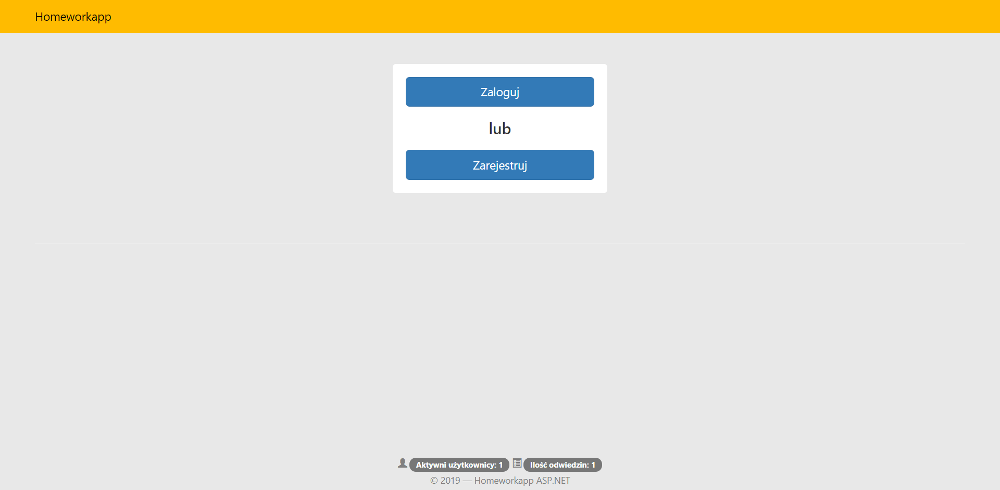
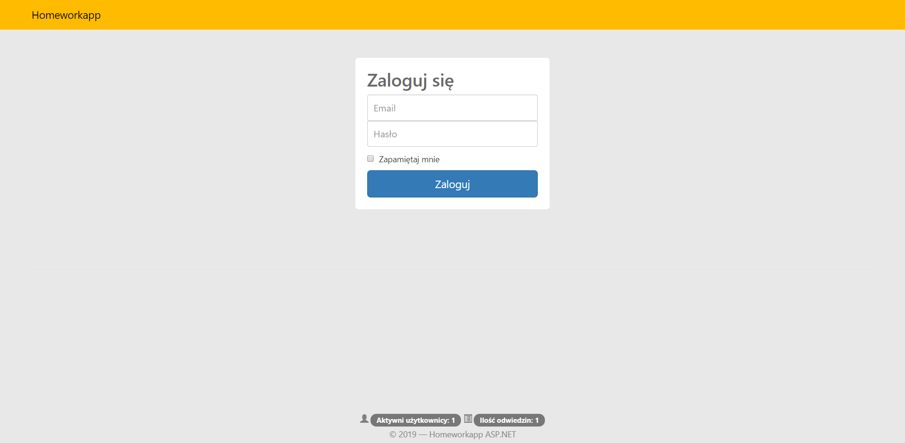
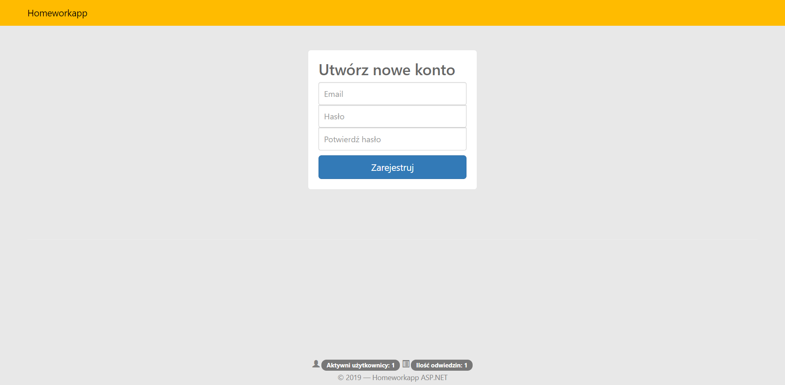
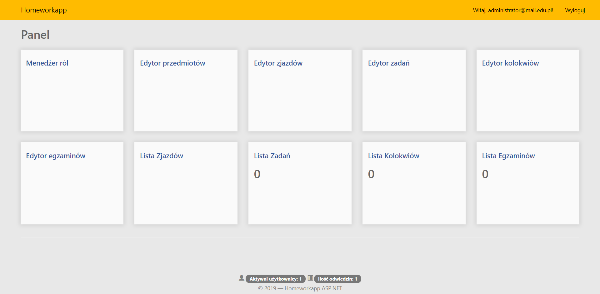
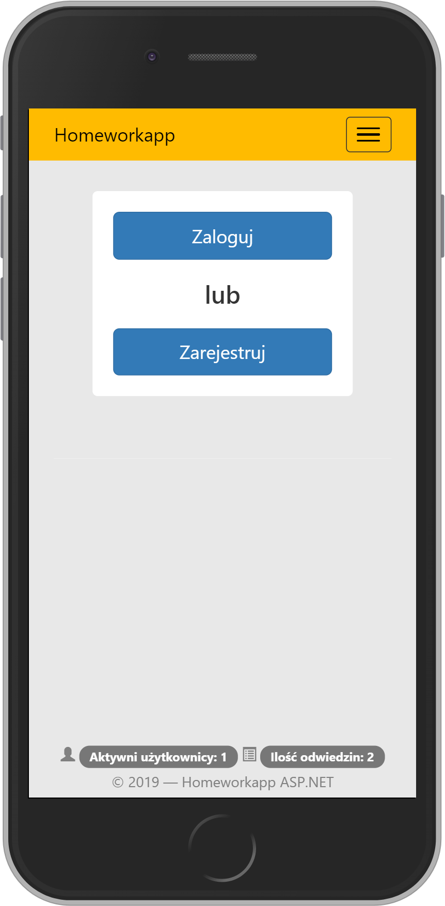
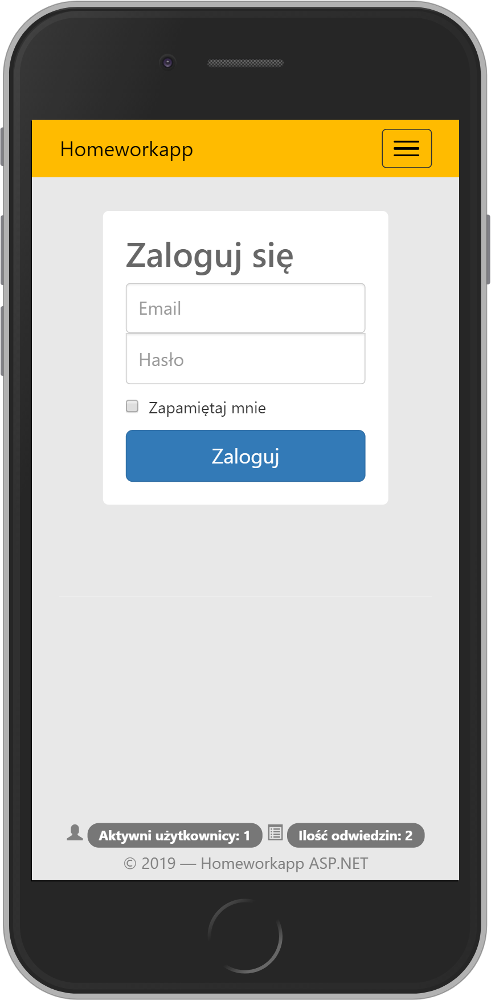
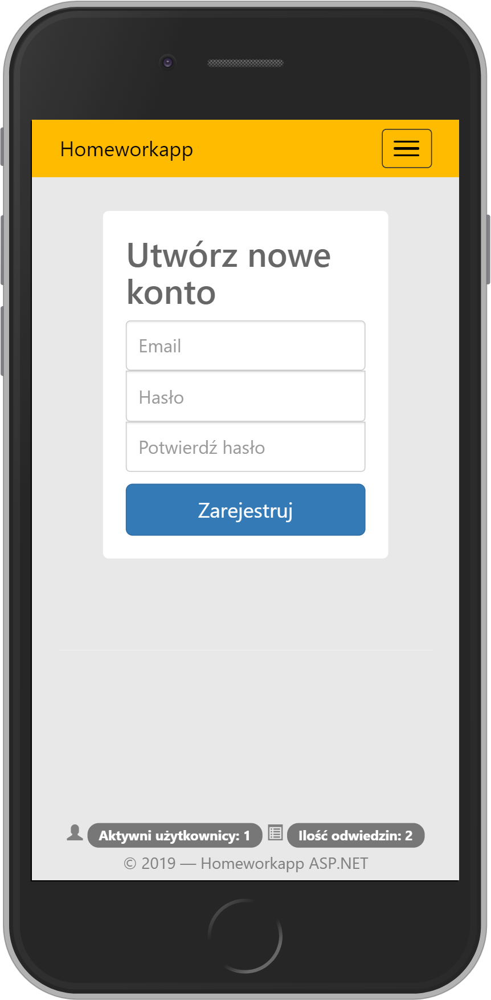
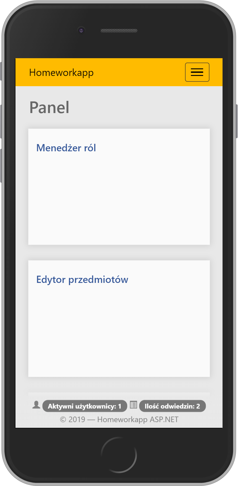
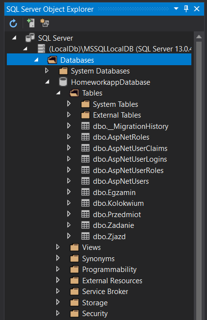

# Homeworkapp
University project on ASP.NET Framework (part-time BSc studies of Computer Science on University of Gdansk - 2018/2019 winter semester) <br><br>
**Author:** Janusz Schőnrock <br>
**Github:** https://github.com/johnnyrock92 <br>
**Linkedin:** www.linkedin.com/in/janusz-schonrock/

<div align="center">
        
        
        
        
        
        
        
        
</div>

#### IDE
* Visual Studio 2017 *(ver. 15.9.4)* - [source](https://visualstudio.microsoft.com)

#### Used libraries
* .NET Framework *(ver. 4.6.1)*
* MSSQL *(ver. 13.0.4001)*
* EntityFramework *(ver. 6.2.0)*
* Bootstrap *(ver. 3.3.7)*
* AspNet.Mvc *(ver. 5.2.4)*
* AspNet.Razor *(ver. 3.2.4)*

## Database
### MSSQL
After first run application in Visual Studio, database will be create automatically. You should see in SQL Server window this view:
<div align="center">
        
</div>

## Default user:
```
Login: administrator@mail.edu.pl
Password: Test1!
```